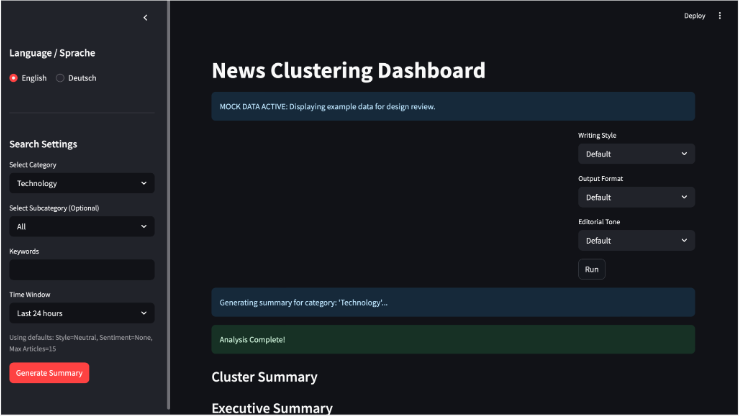

# LLM-Powered News Summary Agent

An end-to-end news intelligence platform that collects articles, groups related
stories, generates summaries and topic labels, and delivers structured results
through automated workflows and a dashboard.

> **Collaborative software project**
>
> **My role:** LLM Team Lead  
> **Primary AI coding tool:** Cursor
> 
> **Project context:** Developed collaboratively as part of a software project at Freie Universität Berlin

## My Contribution

I led the LLM team and coordinated the planning, implementation, debugging, and
technical validation of the language-model components.

My contributions included:

- Leading the design and implementation of the LLM news-processing pipeline,
  including translation, semantic clustering, topic labelling, keyword
  extraction, and multi-level summarisation.
- Building and coordinating FastAPI backend services for summarization,
  clustering, keyword extraction, topic analysis, and evaluation workflows.
- Developing LDA topic-modeling and TF-IDF keyword-extraction pipelines.
- Conducting code reviews, debugging, and technical quality assurance across
  the LLM workflows.
- Implementing performance improvements through caching, parallel processing,
  and incremental updates.
- Producing technical documentation covering the LLM architecture, evaluation
  methodology, and integration requirements.

## How I Used AI Coding Tools

I used Cursor as my primary AI-assisted development environment while building
the LLM components of this project.

My workflow typically involved:

1. Defining the task, expected inputs and outputs, and system constraints.
2. Asking Cursor to inspect the relevant files and propose an implementation
   approach.
3. Using it to accelerate Python and FastAPI implementation, code refactoring,
   debugging, test-case generation, and technical documentation.
4. Reviewing and modifying the generated code rather than accepting it
   automatically.
5. Running the workflow, inspecting errors and model outputs, and using the
   results to guide further iterations.
6. Validating the final architecture, business logic, prompts, and output quality
   myself and with the project team.

Cursor helped me navigate and contribute efficiently across a multi-service
codebase, while I remained responsible for the architecture, integration
decisions, output validation, and final technical judgement.

### Representative Implementation

A representative example is the FastAPI service connecting the summarization,
clustering, keyword-extraction, and evaluation components:

- [View the relevant implementation](https://github.com/Abbysola/news-summary-agent/tree/main/cswspws25-m3-final/src)
- [View the related technical documentation](INSERT-DOCUMENTATION-LINK)

I used Cursor to inspect the surrounding modules, propose the initial structure,
identify duplicated logic, assist with refactoring, and generate edge cases.
I then tested the service, reviewed the generated outputs, and corrected issues
requiring architectural or analytical judgement.

## System Overview

The platform transforms streams of raw news articles into structured,
dashboard-ready intelligence:

- Collects articles from multiple news sources.
- Groups semantically related articles into story clusters.
- Generates article-level, cluster-level, and category-level summaries.
- Produces topic labels, keywords, categories, and translations.
- Stores articles and generated artefacts in OpenSearch.
- Orchestrates the end-to-end workflow through n8n.
- Displays processed results through a Streamlit dashboard.

## Demo



## Repository Context

This repository is a monorepo that combines components previously maintained in
separate project branches. They are now kept together to simplify setup,
integration, documentation, and collaboration.

## Technology Stack

| Area | Technologies |
|---|---|
| Backend and APIs | Python, FastAPI |
| LLM processing | Local language models through Ollama |
| NLP and analysis | Semantic embeddings, LDA, TF-IDF |
| Workflow orchestration | n8n |
| Search and storage | OpenSearch |
| Frontend | Streamlit |
| Infrastructure | Docker |
| AI-assisted development | Cursor |

## Example of AI-Assisted Development

One task I used Cursor for was developing and refining the FastAPI services that
connected the summarization, clustering, keyword-extraction, and evaluation
components.

I used Cursor to:

- inspect the existing service structure;
- generate an initial endpoint implementation;
- identify duplicated logic;
- refactor shared processing steps;
- trace integration errors across modules;
- generate edge cases for testing;
- improve type hints and error handling; and
- document endpoint behaviour.

I then reviewed the code, tested the endpoints against representative inputs,
checked the generated summaries and labels, and corrected issues that required
domain or architectural judgement.

## Contents

- [Project Purpose](#project-purpose)
- [Core Capabilities](#core-capabilities)
- [Monorepo Structure](#monorepo-structure)
- [Architecture Overview](#architecture-overview)
- [End-to-End Processing Flow](#end-to-end-processing-flow)
- [Project Structure Design](#project-structure-design)
- [Where To Start](#where-to-start)
- [Start Here For Workflow Logic](#start-here-for-workflow-logic)
- [Implementation References](#implementation-references)
- [Contributors](#contributors)
- [Team Contributions](#team-contributions)
- [Acknowledgements (Non-GitHub Contributors)](#acknowledgements-non-github-contributors)

## Project Purpose

The project is designed to turn large streams of raw news into structured, readable intelligence.
The pipeline continuously gathers articles and produces:

- grouped stories (clusters of related articles),
- concise summaries and labels,
- category-level overviews ("mega summaries"),
- dashboard-ready and webhook-accessible outputs.

This is especially useful for monitoring topics over time and quickly spotting major developments across multiple publishers.

## Core Capabilities

- **Automated ingestion** from multiple news sources via crawler endpoints.
- **Incremental clustering** so newly crawled articles can be attached to existing story groups.
- **LLM-powered enrichment** for summarization, topic labeling, keyword extraction, and translation.
- **Category mapping and mega summaries** to provide higher-level views beyond single clusters.
- **Operational delivery** through n8n workflows, webhooks, and a Streamlit dashboard.

## Monorepo Structure

- `n8n/` - Orchestration layer and main setup entrypoint.
- `opensearch/` - OpenSearch stack and index restore scripts.
- `cswspws25-WebCrawlerMain/` - Crawler service source.
- `cswspws25-m3-final/` - LLM service source.
- `frontend/` - Dashboard/frontend source.

For detailed branch/import mapping, see `README-repo-layout.md`.

## Architecture Overview

At a high level:

1. Crawler fetches articles.
2. n8n workflows orchestrate processing and trigger services.
3. LLM service generates clustering, summaries, labels, and related outputs.
4. OpenSearch stores articles, clusters, and summary artifacts.
5. Frontend/dashboard reads data and displays results.

Most pipeline logic is orchestrated by n8n workflows.

### Architecture Diagram

```text
+------------------------------------------------------------------+
|                       Docker Network                             |
|------------------------------------------------------------------|
|                                                                  |
|  [Crawler] ─────▶ [n8n] ─────▶ [llm-service] ─────▶ [Ollama]     |
|                     │                                            |
|                     │                                            |
|                     ├────────────▶ [Dashboard]                   |
|                     │                 │                          |
|                     │                 ▼                          |
|                     └────────────▶ [OpenSearch]                  |
|                                                                  |
+------------------------------------------------------------------+
```

## End-to-End Processing Flow

1. **Collect**: crawler service fetches fresh articles.
2. **Store raw articles**: n8n writes ingested data into OpenSearch (`articles` and related indices).
3. **Cluster and enrich**: n8n calls LLM-service endpoints for cluster creation/merging, summaries, labels, and keywords.
4. **Categorize**: clusters are mapped into semantic categories.
5. **Aggregate**: mega summaries are generated per category.
6. **Serve results**: outputs are exposed to the dashboard and webhook endpoints.

For workflow-level technical behavior, use `n8n/workflows/docs/` as the canonical reference.

## Project Structure Design

```text
SWP-News-Summary/
│
├── n8n/
│   ├── bundle/
│   │   ├── n8n-data.tar.gz
│   │   └── opensearch-data.tar.gz
│   ├── bundle_data_setup.sh
│   ├── complete_setup.sh
│   ├── docker/
│   │   ├── n8n/setup_n8n.sh
│   │   ├── llm-service/setup-llm-service.sh
│   │   ├── crawler/setup-crawler-service.sh
│   │   └── streamlit-frontend/setup-frontend-service.sh
│   ├── docs/
│   ├── workflows/
│   │   ├── n8n json/
│   │   └── docs/
│   └── README.md
│
├── opensearch/
│   ├── docker-compose.yml
│   └── scripts/restore_indices.sh
│
├── frontend/
├── cswspws25-WebCrawlerMain/
└── cswspws25-m3-final/
```

## Where To Start

Use the n8n documentation as the primary operational guide:

- Main setup and runtime guide: `n8n/README.md`
- Bundle-focused setup details: `n8n/README-bundle-data-setup.md`

Recommended first run path:

1. Read prerequisites and layout expectations in `n8n/README.md`.
2. Run setup from `n8n/` using `bundle_data_setup.sh`.
3. Verify services and ports as documented in `n8n/README.md`.

## Start Here For Workflow Logic

If you only read one technical area in this repository, read:
`n8n/workflows/docs/`

These workflow documents are the best source for understanding how the pipeline actually behaves in production (crawler scheduling, clustering logic, summarization flow, categorization, mega summaries, and webhook behavior).

Suggested reading order:

1. `n8n/workflows/docs/M3_Workflows_Overview.md`
2. `n8n/workflows/docs/M3_News_Crawler.md`
3. `n8n/workflows/docs/M3_Clustering_Summary_Label.md`
4. `n8n/workflows/docs/M3_Categorize_Clusters_Workflow_Technical_Overview.md`
5. `n8n/workflows/docs/M3_Mega_Summary_Workflow.md`

## Implementation References

If you want to understand or modify implementation details, start in `n8n/`:

- Workflow technical docs: `n8n/workflows/docs/`
- Exported n8n workflow JSONs: `n8n/workflows/n8n json/`
- Service setup scripts:
  - `n8n/docker/n8n/setup_n8n.sh`
  - `n8n/docker/llm-service/setup-llm-service.sh`
  - `n8n/docker/crawler/setup-crawler-service.sh`
  - `n8n/docker/streamlit-frontend/setup-frontend-service.sh`

Component-specific implementation also lives in:

- `cswspws25-WebCrawlerMain/` for crawler internals.
- `cswspws25-m3-final/` for LLM API/service internals.
- `frontend/` for dashboard behavior.
- `opensearch/` for OpenSearch stack configuration.

## Contributors

- [@lelatvaliashvili](https://github.com/lelatvaliashvili)
- [@eniseirem](https://github.com/eniseirem)
- [@Lennyad](https://github.com/Lennyad)
- [@Abbysola](https://github.com/Abbysola)
- [@resialer2](https://github.com/resialer2)


## Team Contributions

### lelatvaliashvili (Team Lead)
- Led iterative development of the system, coordinating planning and execution while adapting architecture and pipeline design based on experimental results
- Provided technical guidance and review across workflows, ensuring correctness, robustness, and alignment with project goals
- Directed milestone planning and final system validation for demonstration
- Led research and design of the system, including literature review for LLM-based summarization and evaluation methodologies  
- Coordinated project execution across components, translating high-level system goals into concrete tasks and guiding implementation through iterative refinement cycles
- Produced extensive technical documentation formalizing system architecture, pipeline design, and evaluation methodology for reproducibility and analysis  

### eniseirem (N8N Team Lead, End-to-End Workflow & Integration)
- End-to-end workflow orchestration across services using n8n.
- Integration of Crawler, LLM, OpenSearch, and Frontend components.
- API coordination and data schema alignment across teams.
- Performance optimization (batch processing, rate limits, timeout handling).
- Error handling strategies, retry logic, and system reliability improvements.
- Docker-based deployment setup.
- Workflow monitoring, request tracking, and debugging of integration issues.
- Technical documentation, integration guides.
- Cross-team coordination and support for resolving blocking issues during development.

### Lennyad (Data Model Lead)
- Data model design and schema definition across services.
- Testing, validation, and issue triage during integration cycles.
- Support on implementation tasks across services.

### Abbysola (LLM Team Lead)
- Led the LLM team, coordinating planning and technical execution.
- Led the design and implementation of the LLM news-processing pipeline,
  including translation, semantic clustering, topic labelling, keyword
  extraction, and multi-level summarization.
- Built and coordinated the development of FastAPI backend services for
  summarization, clustering, keyword extraction, topic analysis, and
  evaluation workflows.
- Developed LDA topic modeling and TF-IDF keyword extraction pipelines for topic discovery and content analysis.
- Did code reviews, debugging, and technical quality assurance across LLM workflows.
- Implemented performance optimizations including caching, parallelization, and incremental updates.
- Produced technical documentation covering LLM architecture, and evaluation methodology.
  
### @resialer2 (LLM Team Member)
- Testing and validation of the multilingual LLM pipeline (German ↔ English translation and processing).
- Evaluation of output quality, including summaries, topic labeling, and keyword generation for coherence and accuracy.
- Consistency checks across article, cluster, and overall summaries, with documentation of results and issues.

## Acknowledgements (Non-GitHub Contributors)

The following people contributed to the project but are not currently listed as GitHub collaborators: 

- **Demi** - LLM Team 
- **Anh** - Crawlers Team
- **Levin** - Crawlers Team 
- **Shidan** - N8N Team 
- **David** - Frontend Research 
- **Jan** - Frontend Research 


